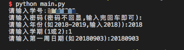
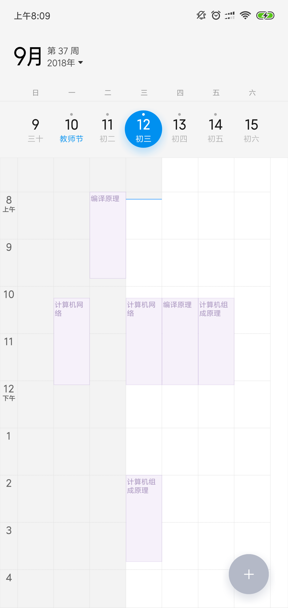
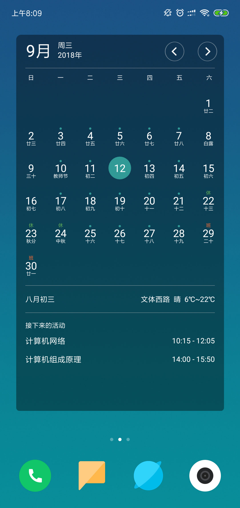
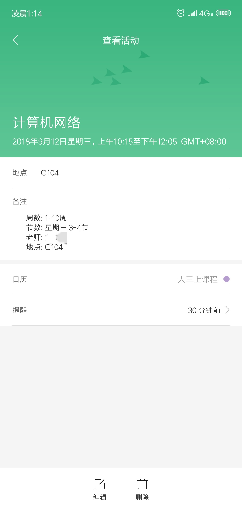

# 教务系统爬虫

> 实现模拟登陆教务系统，爬取实验及日常课表，转换为通用日历格式.ics

## 起因
因为xx课程表查不到实验课，以及其他冗余功能太多，决定自己写一个将课表转换成ics格式的程序，导入到日历

## 难点
1. 教务系统的登陆是采用RSA加密，加密方式和python自带的rsa有一定差别，python3的base64加密会转化为byte格式，需要转成hex
2. 教务系统的接口用cookice校验身份，可以用requests.Session()保持会话
3. 生成日历格式用到了Python 的 icalendar库，文档比较旧，且阅读体验不好


## 使用方式
1. 
    ```
    git clone https://github.com/imyhui/class2ics.git
    cd class2ics
    ```
2. 安装相关依赖(详见[`Pipfile`](./Pipfile))
- 方式一 pipenv (**推荐**)
    ``` shell
    $ pipenv install
    $ pipenv shell
    ```
- 方式二 直接安装
    ``` shell
    $ pip install -r requirements.txt
    ```
3. 运行并按提示输入

   ```shell
   $ python main.py
   ```

   



## 成品展示

> 生成ics文件在主目录，`XXX(2018-2019-1)课表.ics`, 用手机或电脑导入即可

### mac 日历视图
> mac直接双击.ics文件即可导入到日历


### 手机视图

> Android Google Calendar 可以直接导入，若手机日历不支持直接导入(如小米)，可以采用邮件订阅Google日历, 也可下载手机qq邮箱导入

<div align="center">



</div><br>